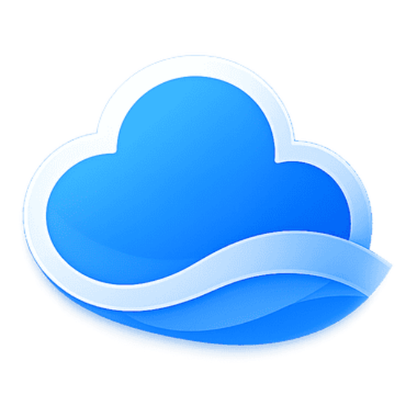
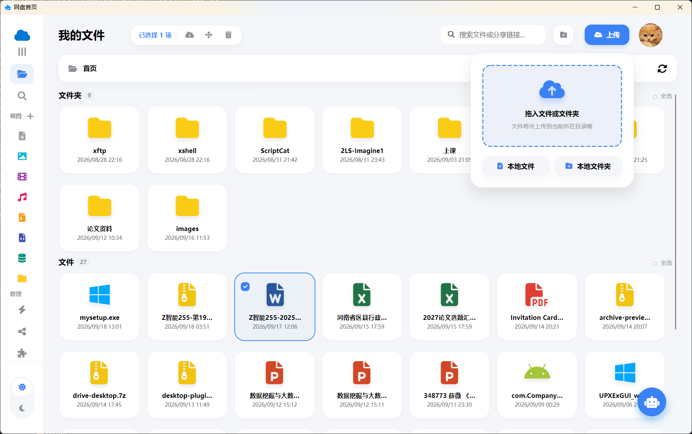
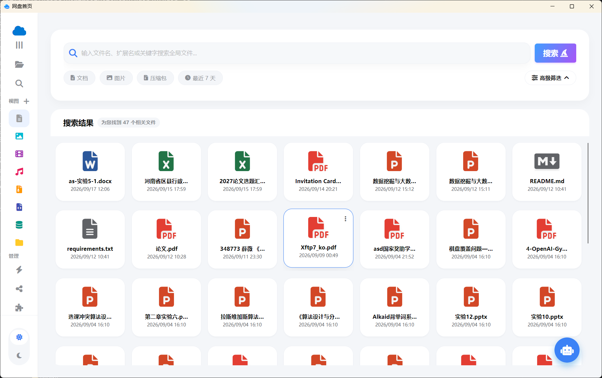
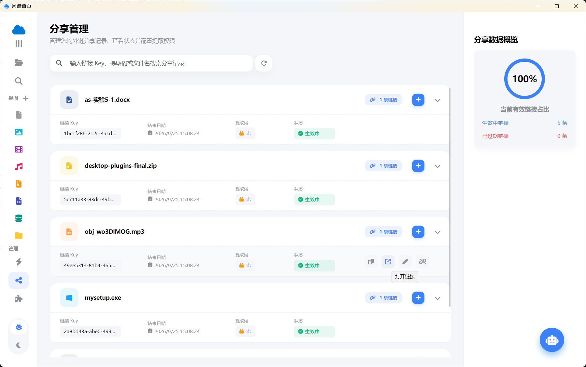
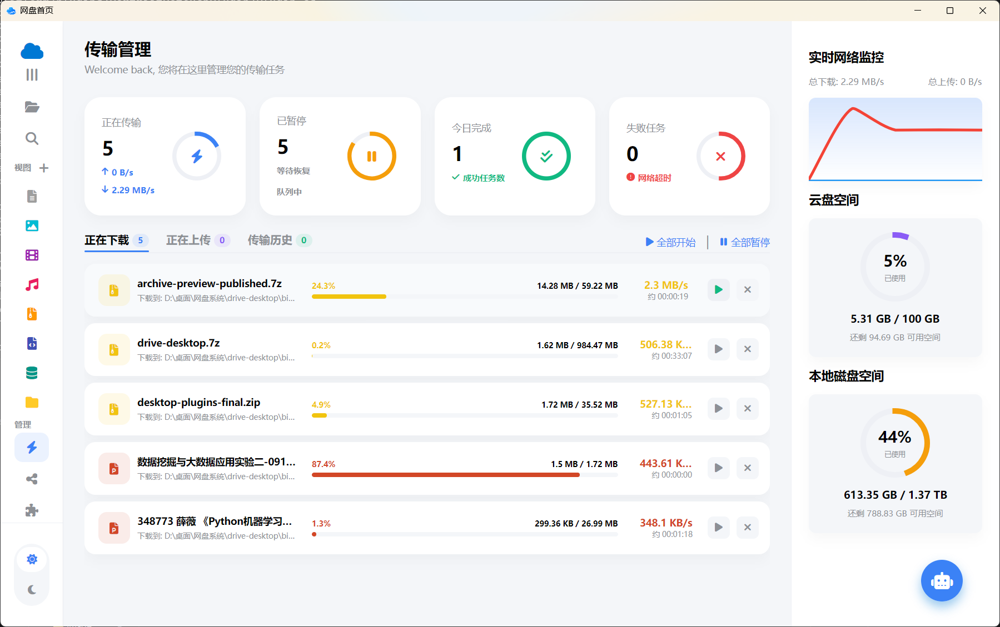
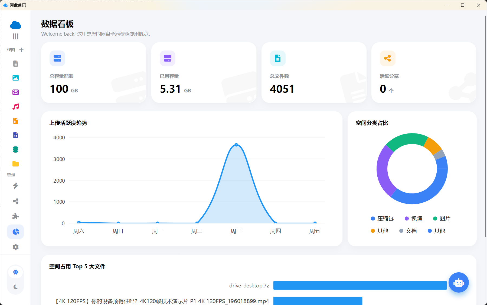
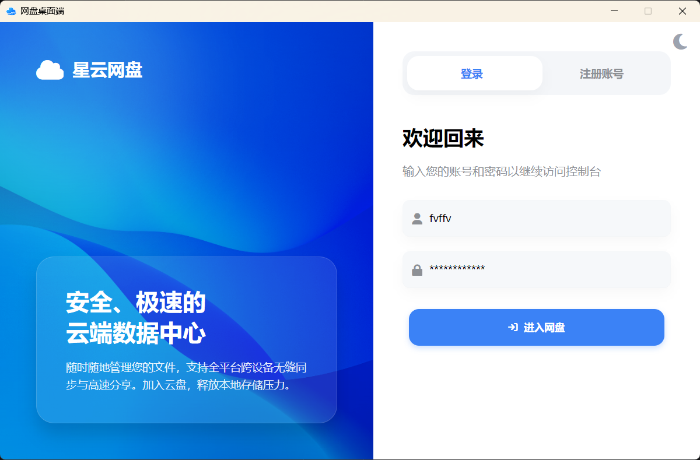
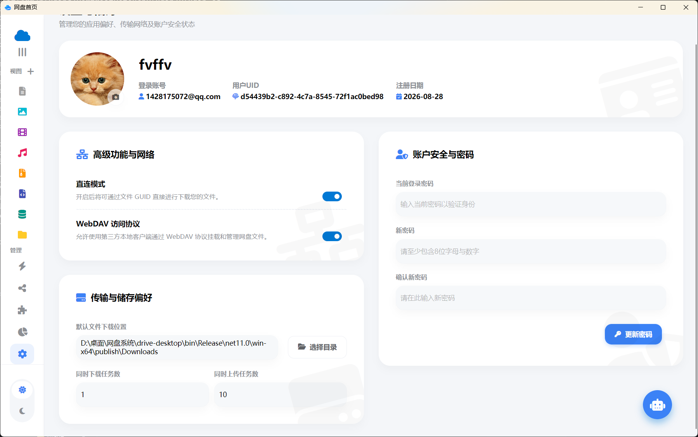
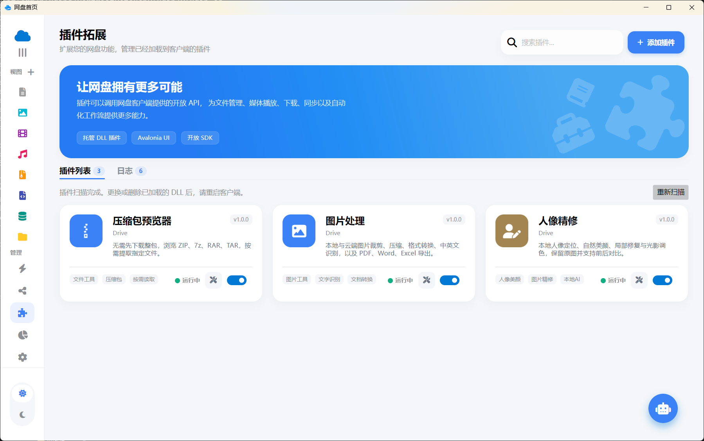

<p align="center">
  
</p>

<h1 align="center">DriveDesktop</h1>

<p align="center"><strong>星云网盘 · 跨平台桌面客户端</strong></p>

<p align="center">让文件管理、在线预览、传输与分享，汇聚到一个桌面窗口。</p>

<p align="center">
  <code>C# / .NET 11</code> &nbsp; <code>Avalonia</code> &nbsp; <code>NativeAOT</code> &nbsp; <code>MIT</code>
</p>

<p align="center">
  <a href="#功能亮点">功能亮点</a> ·
  <a href="#界面预览">界面预览</a> ·
  <a href="#插件扩展">插件扩展</a> ·
  <a href="#开始使用">开始使用</a> ·
  <a href="#开发与构建">开发与构建</a>
</p>

<p align="center">
  <a href="image/home.png"></a>
</p>

<p align="center"><sub>文件与文件夹清晰呈现，拖入文件即可上传。点击截图可查看原图。</sub></p>

## 功能亮点

DriveDesktop 是网盘系统的桌面客户端，基于 Avalonia 构建，面向 Windows、Linux 和 macOS。它将常用的文件操作、分类检索、传输任务、分享管理与插件工具放在同一套界面中，并支持亮色与暗色主题。

| 能力 | 你可以做什么 |
| --- | --- |
| **文件管理** | 浏览文件夹，上传本地文件与文件夹，批量选择、移动、下载和删除，管理自己的分类视图。 |
| **搜索与筛选** | 根据文件名、扩展名和关键词检索，结合类型、时间等条件缩小范围。 |
| **内容预览** | 查看图片、文档、文本与代码，播放音乐和视频，减少来回切换应用。 |
| **传输管理** | 集中查看上传、下载与历史任务，控制暂停与恢复，查看进度、速度及空间使用。 |
| **分享管理** | 创建和管理文件分享链接，查看有效期、提取码与链接状态。 |
| **数据看板** | 了解容量占用、文件数量、分享情况、上传趋势和文件类型分布。 |
| **个性化设置** | 切换明暗主题，设置下载目录、同时传输任务数，以及直链、WebDAV 等账户偏好。 |
| **插件扩展** | 为文件菜单和应用入口增加工具，用普通 C# 与 Avalonia XAML 开发自己的插件。 |

## 界面预览

### 找到文件，也管理好它的分享

<table>
  <tr>
    <td width="50%" valign="top">
      <a href="image/search.png"></a>
      <p><strong>搜索与分类</strong><br />从文档、图片、压缩包等分类进入，用筛选条件找到需要的内容。</p>
    </td>
    <td width="50%" valign="top">
      <a href="image/share.png"></a>
      <p><strong>分享管理</strong><br />按文件整理分享链接，集中查看状态、编辑设置和撤销分享。</p>
    </td>
  </tr>
</table>

### 传输进度与空间使用，一眼可见

<table>
  <tr>
    <td width="50%" valign="top">
      <a href="image/download.png"></a>
      <p><strong>传输中心</strong><br />任务状态、实时速度、完成进度和剩余空间集中展示。</p>
    </td>
    <td width="50%" valign="top">
      <a href="image/kanban.png"></a>
      <p><strong>数据看板</strong><br />从容量与文件类型分布，到上传趋势和大文件排行，了解网盘的使用情况。</p>
    </td>
  </tr>
</table>

### 从登录到日常偏好

<table>
  <tr>
    <td width="50%" valign="top">
      <a href="image/login.png"></a>
      <p><strong>账户入口</strong><br />登录或注册账户，进入自己的云端文件空间。</p>
    </td>
    <td width="50%" valign="top">
      <a href="image/setting.png"></a>
      <p><strong>按习惯设置</strong><br />调整下载位置、传输任务数和账户偏好，让客户端适应你的使用方式。</p>
    </td>
  </tr>
</table>

## 插件扩展

除了文件管理，也可以直接在网盘工作流中打开压缩包、处理图片、精修人像。插件页提供启用与停用、独立窗口入口和日志查看。

<p align="center">
  <a href="image/plugin.png"></a>
</p>

| 内置插件 | 功能 |
| --- | --- |
| [**压缩包预览器**](PluginPlatform/plugins/ArchivePreviewPlugin/README.md) | 浏览 ZIP、7z、RAR 和 TAR 的内容，通过 HTTP Range 按需读取并缓存，选择包内文件提取到下载目录。 |
| [**图片处理**](PluginPlatform/plugins/ImageToolsPlugin/README.md) | 选择本地或云端图片，裁剪、压缩、转换格式、中英文 OCR，导出 PDF、Word 和 Excel。 |
| [**人像精修**](PluginPlatform/plugins/PortraitRetouchPlugin/README.md) | 本地 ONNX 人脸定位，结合美颜、调色和局部修复，支持前后对比、撤销重做与图片导出。 |

压缩包按需读取需要服务器支持 Range；固实压缩包可能需要读取较多前序数据，实际流量取决于压缩格式与所选文件。

### 用 C# 编写你的插件

主程序与插件采用独立进程架构：主程序可以 NativeAOT 发布，普通托管插件由自包含的 `Drive.Plugin.Runner` 加载，通过本地管道访问宿主 API。插件的 Avalonia 窗口由运行器提供 UI 线程和共享依赖。

- **宿主 API**：文件、上传下载、账户、菜单、插件存储、系统信息与日志。
- **29 个宿主事件**：目录变化、传输完成、分享变更、搜索、文件双击、视图变化等。
- **菜单扩展**：分别注册文件与文件夹菜单，按文件类型展示入口。
- **开发体验**：中文 XML 文档注释、权限声明、完整事件模板，以及窗口复用和生命周期管理。

开发入口：[SDK 说明](PluginPlatform/Drive.Plugin.SDK/README.md) · [Avalonia 窗口开发](PluginPlatform/Drive.Plugin.Avalonia/README.md) · [插件模板说明](PluginPlatform/Templates/drive-plugin/README.md)

## 开始使用

1. 准备与客户端兼容的网盘服务端。此仓库提供桌面客户端，文件与账户能力由配套服务端提供。
2. 首次启动会在程序目录生成 `config.json`。如需连接自己的服务端，关闭程序后修改其中的 `ServerIp`，再重新启动。
3. 登录账户，在文件页上传和整理内容；在设置中选择下载保存位置和传输任务数。
4. 需要扩展工具时，前往插件页查看权限、授权并启用插件。

部署时保留完整发布目录。主程序与 `Drive.Plugin.Runner` 放在同一层，插件位于 `Plugins/` 下；插件自己的 JSON、模型、字典及原生依赖也是运行所需的文件。

## 开发与构建

<details>
<summary><strong>展开环境要求、发布命令与项目结构</strong></summary>

### 开发环境

- C# / **.NET 11**，当前 `global.json` 使用 `11.0.100-rc.1.26425.128`，允许预发布 SDK。
- **Avalonia 12.1.2**，结合 MVVM、编译绑定与 NativeAOT。
- 主程序采用 NativeAOT，构建环境需具备目标平台所需的本机编译工具链。
- 仓库中的 `NuGet.Config` 包含开发者本机包源；首次在其他机器还原前，请按本机环境调整或移除该源，并确认依赖版本可获取。

### 发布 Windows x64 客户端

在仓库根目录执行：

```powershell
dotnet publish drive-desktop.csproj -c Release -r win-x64
```

默认输出目录：

```text
bin/Release/net11.0/win-x64/publish/
├── drive-desktop.exe
├── Drive.Plugin.Runner.exe
└── Plugins/
    ├── ArchivePreviewPlugin/
    ├── ImageToolsPlugin/
    └── PortraitRetouchPlugin/
```

上面仅列出主要入口，实际发布目录还包含必要依赖与资源。主项目会自动发布并部署运行器和三个内置插件，无需分别手动复制。

项目面向 Windows、Linux 与 macOS；当前运行验证以 Windows x64 为主。其他平台需要对应 RID 的运行器、原生依赖和本机编译环境，不能直接使用 Windows 的发布产物。

### 项目结构

```text
DriveDesktop/
├── Assets/             应用图标、字体与界面资源
├── Components/         页面组件与可复用控件
├── Views/              Avalonia 视图
├── ViewModels/         界面状态与交互逻辑
├── Services/           API、账户、主题、传输及插件集成
├── Models/             数据模型
├── PluginPlatform/     插件 SDK、独立运行器、模板与内置插件
└── image/              项目截图与 README 展示资源
```

</details>

## 许可证

本项目采用 [MIT License](LICENSE)，Copyright © 2026 fvffv。

第三方库、字体和模型遵循各自的许可证；相关声明随对应组件提供。

<p align="center"><sub>DriveDesktop · 文件管理与插件工具，在桌面上连接起来。</sub></p>
